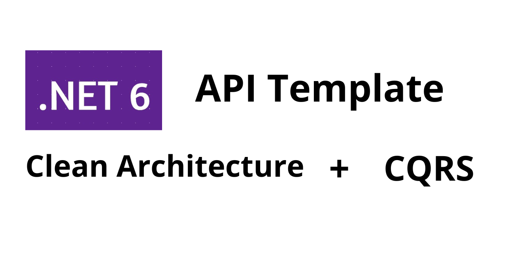

# API Template - Microservice

This project, was developed with purpose of help o development fast of API's using CQRS, Clean Architecture, SOLID. Also serving as guideline to good habits.

This API exists um example of Create e Get of one Car Entity, only how example, because when will use to other context, must delete. Also, one example of security API with token JWT.

## About technologies used

- C# 10
- .NET 6
- ORM: Entity Framework
- SOLID
- Clean Architecture
- Database in Memory
- Can use Code first or Database first
- MediatR
- Swagger
- Security JWT
- Service Bus - Message producer service
- AutoMapper

## How install Template 

Root file TemplateMicroservice, type it. Then the template will be installed on your computer.
```powershell
dotnet install ./
```
Then just use the template.

```powershell
dotnet new webapi_cqrs_clean_architecture -n Product 
```
I used the name Product, because I wanted to create one API about context of product, but you can to put anything name to your API.


## Roadmap

  - [ ]  Unit Test how example. Using XUnit and Moq to test handlers.
  - [ ]  Apply StyleCop  
  - [ ]  Add ProblemsDetails
  - [ ]  SignalR
  - [ ]  Delete and Put - Method Http
  - [ ]  BulkInsert


# Reference

These are some link that me helped the development of this project. Maybe help you :)

https://learn.microsoft.com/en-us/dotnet/core/tools/custom-templates
https://www.luisdev.com.br/2020/09/29/clean-architecture-com-asp-net-core-parte-1/
https://www.macoratti.net/21/01/aspnc_cleanarch3.htm


## Authors

- [@github-abnermatheus](https://www.github.com/abnermatheus)
- [@linkedin-abnermatheus](https://www.linkedin.com/in/abnermatheus) 

